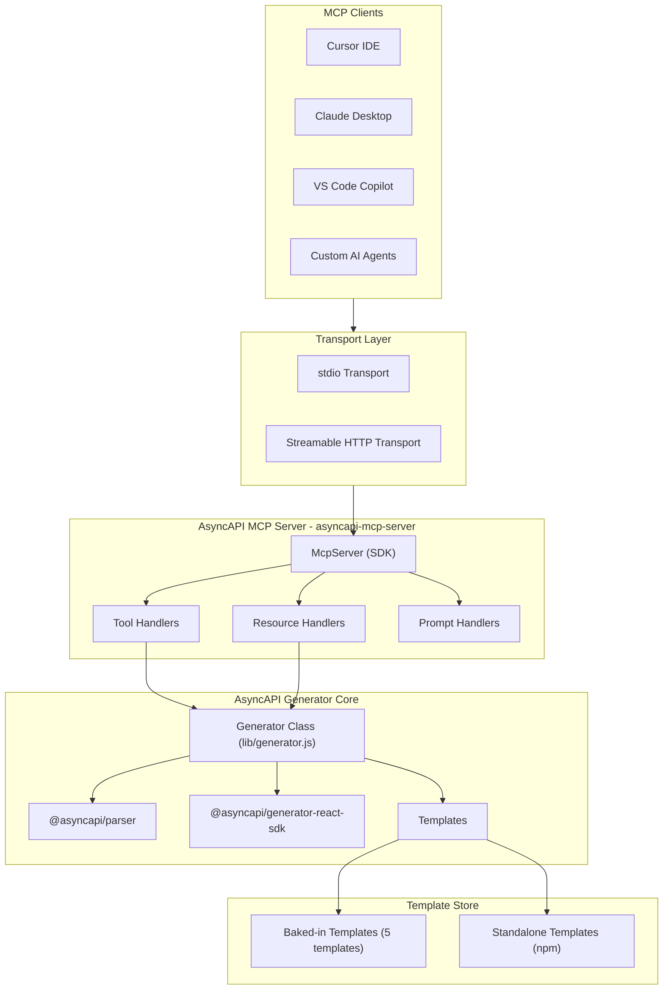

# AsyncAPI MCP Server — Research

---

## 1. What is an MCP Server?

**MCP (Model Context Protocol)** is an open standard created by Anthropic (Nov 2024) that defines how AI models communicate with external tools, data sources, and services. It uses **JSON-RPC 2.0** as its wire format and is completely model-agnostic.

**Analogy:** MCP is to AI what USB-C is to devices -- build one server, and any MCP-compatible client can use it.


**Three Primitives an MCP Server can expose:**

- **Tools** -- Functions the AI can call (e.g., generate code from a spec, validate a document). These are the primary building blocks.
- **Resources** -- Read-only data the AI can consume (e.g., list of available templates, template parameters, sample AsyncAPI specs).
- **Prompts** -- Pre-built prompt templates for common workflows (e.g., "generate a WebSocket client from this spec").

**Two Transports:**

- **stdio** -- Local subprocess communication. Ideal for IDE integrations (Cursor, Claude Desktop, VS Code). Zero network exposure.
- **Streamable HTTP** -- Remote HTTP-based transport. Ideal for multi-user/SaaS deployments. Supports OAuth 2.1 auth.

**Adoption as of 2026:** Claude Desktop, Claude Code, Cursor, VS Code (Copilot), Windsurf, Zed, JetBrains, Sourcegraph, and 200+ other tools support MCP natively. Over 2,300 public MCP servers exist.

---

## 2. Can We Build an AsyncAPI MCP Server?

**Yes, absolutely.** An **AsyncAPI MCP server** can expose the full workflow around AsyncAPI documents — parsing and validation, template discovery, and code or documentation generation — not only generation. The official **AsyncAPI Generator** provides a well-defined **programmatic Library API** ([`lib/generator.js`](apps/generator/lib/generator.js)) that maps cleanly to MCP tools, alongside `@asyncapi/parser` for document handling. Key reasons this is feasible:

- The Generator class exposes methods like `generate()`, `generateFromURL()`, `generateFromFile()`, `validateAsyncAPIDocument()`, and `listBakedInTemplates()` that map directly to MCP tools; parsing and spec summarization are covered by `@asyncapi/parser` and complementary tools.
- The upstream AsyncAPI tools are Node.js — the MCP TypeScript SDK (`@modelcontextprotocol/sdk`) is a natural fit.
- There was no first-party AsyncAPI MCP server in this mold (the closest is Apicurio's data-models MCP for document editing, not a full AsyncAPI + generator surface).
- The generator already separates template logic from generation logic, making that slice easy to wrap inside a broader AsyncAPI-focused MCP server.

---

## 3. Real-World Use Cases (from case studies)

Analysis of 17+ company adopters (eBay, Walmart, LEGO, Adobe, Oracle, Adidas, SAP, etc.) reveals these recurring use cases, ordered by frequency:

1. **Documentation generation** — Nearly universal. Companies generate human-readable docs (HTML, Markdown) from AsyncAPI specs for developer portals and internal wikis. (Adeo, HDI, Zora Robotics, Siemens, PagoPA, Oracle, Adobe, Morgan Stanley, Adidas)
2. **Code & client generation** — Generate client libraries, models, and server stubs from specs to reduce manual coding. (eBay, Oracle, Adobe, Open University of Catalonia, Adidas)
3. **Validation & governance** — Use AsyncAPI as a contract. Validate specs in CI/CD, enforce schema consistency, prevent breaking changes at PR level. (LEGO, Walmart, Bank of NZ, Kuehne+Nagel, TransferGo, Lombard Odier)
4. **Spec understanding & parsing** — Every workflow starts with "what's in this spec?" — extracting channels, servers, messages, schemas for decision-making. (Implicit in all adopters)
5. **Infrastructure provisioning** — Use specs to auto-provision Kafka topics, broker access, event routing. (LEGO, Raiffeisen Bank, Postman — niche, not directly wrappable by generator)
6. **Mocking & contract testing** — Generate mocks from specs for testing without live brokers. (TransferGo via Microcks, Lombard Odier)

Sources: [asyncapi.com/casestudies](https://www.asyncapi.com/casestudies), [asyncapi.com/tools](https://www.asyncapi.com/tools)

---

## 4. Available APIs in the Ecosystem

| Package | What it does | Relevant for our MCP? |
|---|---|---|
| `@asyncapi/generator` | Generate code/docs from templates, list baked-in templates | **Yes — core for template listing and generation tools** |
| `@asyncapi/parser` | Parse & validate AsyncAPI documents, extract structured info | **Yes — direct dependency for parse and validation tools** |
| `@asyncapi/modelina` | Generate typed payload models (Java, TS, Go, Python, etc.) | Future — separate tool |
| `@asyncapi/converter` | Convert old spec versions (1.x, 2.x) to latest | Future — nice to have |
| `@asyncapi/bundler` | Bundle multi-file specs into a single document | Future — nice to have |
| `@asyncapi/diff` | Compare two specs, detect breaking changes | Future — nice to have |

---

## 5. Core Features (prioritized by real-world usage)

### 5.1 Tools (AI-callable functions)

Ordered from most to least useful based on case study frequency and developer workflow:

| Priority | Tool Name | Description | Input | Output | Justification |
|---|---|---|---|---|---|
| **P0** | `generate` | Generate code/docs from an AsyncAPI document using a template | `asyncapiDocument` (string), `templateName`, `templateParams`, `targetDir` | Generated file paths or string output | #1 and #2 use case combined — this is the core value proposition |
| **P0** | `validate_document` | Validate an AsyncAPI document for correctness | `asyncapiDocument` (string or file path) | Validation result (valid/errors) | #3 use case — validation is the most common CI/CD integration; also a prerequisite before generation |
| **P0** | `list_baked_templates` | List available baked-in templates with filtering | Optional filters: `type`, `stack`, `protocol`, `target` | Array of template metadata | **Done** ✅ — Essential for discoverability before calling `generate` |
| **P1** | `parse_document` | Parse an AsyncAPI document and return structured info (channels, servers, messages, schemas) | `asyncapiDocument` (string) | Parsed document summary | #4 use case — understanding a spec is the first step in every workflow |
| **P1** | `generate_from_url` | Generate from a remote AsyncAPI spec URL | `url`, `templateName`, `templateParams` | Generated files | Convenience wrapper — many public specs are hosted remotely (eBay, Oracle) |
| **P2** | `get_template_info` | Get detailed info about a specific template (params, config) | `templateName` | Template config, parameters, supported protocols | Helps AI pick the right params before calling `generate` — useful but AI can also just try |

### 5.2 Resources (read-only context)

Ordered by how often an AI would need this context:

| Priority | Resource | URI Pattern | Description |
|---|---|---|---|
| **P0** | Template list | `asyncapi://templates` | Full list of baked-in templates — essential for the AI to know what's available |
| **P1** | Template details | `asyncapi://templates/{name}` | Config, parameters, metadata for a specific template — helps AI configure `generate` correctly |
| **P2** | Sample specs | `asyncapi://examples/{name}` | Example AsyncAPI documents for different protocols — useful for demos and learning |
| **P3** | Supported protocols | `asyncapi://protocols` | Aggregated list of protocols across templates — low value, derivable from template list |

### 5.3 Prompts (reusable workflows)

Ordered by how frequently users would trigger these workflows:

| Priority | Prompt | Description | Arguments |
|---|---|---|---|
| **P0** | `generate-client` | Guided workflow: pick protocol + language, validate spec, select template, generate client | `protocol`, `language`, `asyncapiSpec` |
| **P1** | `generate-docs` | Generate documentation from a spec (HTML or Markdown) | `format` (html/markdown), `asyncapiSpec` |
| **P1** | `explain-spec` | Parse and explain an AsyncAPI document in plain language — what servers, channels, messages exist | `asyncapiSpec` |
| **P2** | `scaffold-project` | Full project scaffolding from an AsyncAPI spec — generate + add build files + README | `protocol`, `language`, `projectName` |

---

## 6. How Others Can Use It

### 6.1 Local Usage (stdio transport)

Users install the MCP server as an npm package and configure their IDE:

**Cursor / Claude Desktop config:**
```json
{
  "mcpServers": {
    "asyncapi": {
      "command": "npx",
      "args": ["asyncapi-mcp-server"]
    }
  }
}
```

Then in any AI chat, the user can say:
- "Generate a WebSocket client in JavaScript from my asyncapi.yaml"
- "Validate my AsyncAPI document"
- "List all available templates for Kafka"

The AI automatically discovers and calls the MCP tools.

### 6.2 Remote Usage (Streamable HTTP transport)

Deploy as a hosted service for teams:
```
https://mcp.asyncapi.com/mcp
```

Clients connect via HTTP, enabling:
- Multi-user access with OAuth 2.1 auth
- CI/CD integration
- Shared template registries

### 6.3 VS Code Extension

VS Code users get MCP tools in Agent Mode, prompts as slash commands, and resources as attachable context.

---

## 7. Architecture



### Server Structure

```
  src/
    index.ts                          # Entry point — wires stdio transport and starts server
    server.ts                         # McpServer factory — creates server, registers all tools
    generator-api/
      index.ts                        # CJS bridge — listBakedInTemplates via require("@asyncapi/generator")
      types.ts                        # TemplateFilter, TemplateInfo
    parser-api/
      index.ts                        # parseDocument() — Parser + validation
      types.ts                        # ParsedDocument, ParsedServer, ParsedChannel, etc.
      utils.ts                        # looksLikeFilePath, resolveInput, toParsedDocument
    tools/
      index.ts                        # Barrel — collects all tool modules into an array
      list-templates/                 # list_baked_templates tool
        index.ts                      # Tool definition: name, description, execute, register
        params.ts                     # Zod input schema + inferred QueryParams type
      generate/                       # (planned) generate, generate_from_url tools
        index.ts
        params.ts
      validate/                       # (planned) validate_document tool
        index.ts
        params.ts
      parse-document/                 # parse_document tool
        index.ts
        params.ts
      get-template-info/              # (planned) get_template_info tool
        index.ts
        params.ts
    resources/                        # (planned)
      templates.ts                    # Template list/detail resources
      examples.ts                     # Sample spec resources
      protocols.ts                    # Supported protocols resource
    prompts/                          # (planned)
      generate-client.ts              # Client generation workflow
      generate-docs.ts                # Docs generation workflow
      explain-spec.ts                 # Spec explanation workflow
    utils/                            # (planned)
      temp-dir.ts                     # Temp directory management
      output.ts                       # Output formatting for MCP responses
  package.json
  tsconfig.json
```

---

## 8. Tech Stack

| Component | Technology | Reason |
|---|---|---|
| MCP SDK | `@modelcontextprotocol/sdk` v1.x (stable) | Official TypeScript SDK, production-ready |
| Schema validation | `zod` | Required peer dependency of MCP SDK, also great for input validation |
| Code generation (templates) | `@asyncapi/generator` | Exposed through the AsyncAPI MCP server’s generator-oriented tools |
| AsyncAPI parsing | `@asyncapi/parser` v3.x | Document parsing and validation; also used alongside generator features |
| Language | TypeScript | Matches MCP SDK, strong typing, monorepo-compatible |
| Build | `tsc` | Simple TypeScript compilation, no bundler needed |
| Transport (local) | stdio | Default for IDE integrations |
| Transport (remote) | Streamable HTTP (planned) | For deployed/shared servers |
| Testing | `vitest` + `mcp-testing-kit` | See testing analysis below |
| Package manager | npm | Matches the monorepo setup |

---

## 9. Testing Strategy

**Why `vitest` over Jest:**
- Native ESM support (our project is `"type": "module"`)
- Faster execution (Vite-powered)
- Same `describe`/`it`/`expect` API as Jest
- Dominant in modern TypeScript projects
- First-class TypeScript support — runs `.ts` files directly, no pre-compilation

**Why MCP SDK's own `Client` + `InMemoryTransport` (instead of `mcp-testing-kit`):**
- Zero extra dependencies — `@modelcontextprotocol/sdk` already provides `InMemoryTransport.createLinkedPair()` and `Client`
- Official, stable API — not a 13-star third-party wrapper
- Full MCP protocol fidelity — tests the real JSON-RPC request/response cycle in-process
- `Client.callTool()` and `Client.listTools()` are the same methods any real MCP client uses


**Test structure:**
```
tests/
  helpers.ts                  # createTestClient() helper
  tools/
    list-templates.test.ts    # list_baked_templates tool tests
    parse-document.test.ts    # parse_document tool tests
```

---