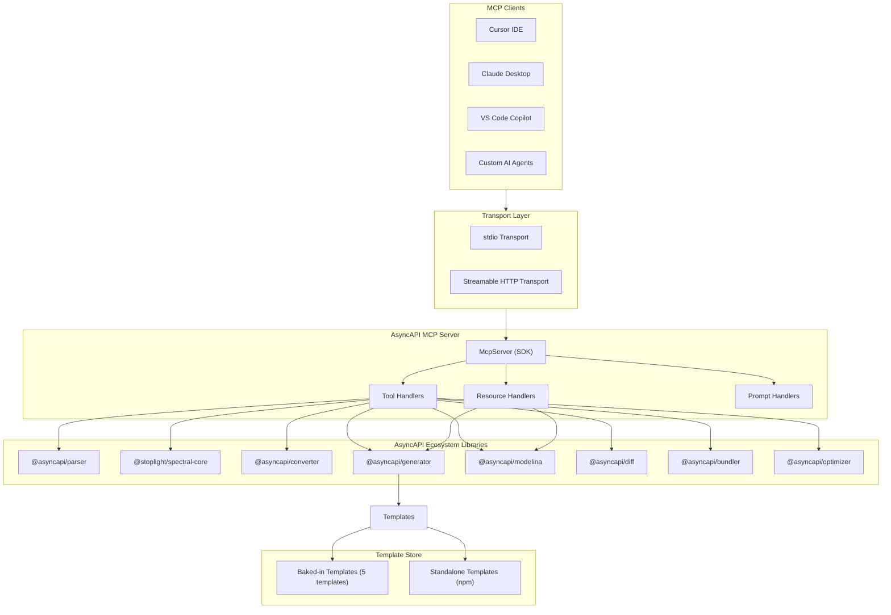

# AsyncAPI MCP Server — Research

---

## 1. What is an MCP Server?

**MCP (Model Context Protocol)** is an open standard created by Anthropic (Nov 2024) that defines how AI models communicate with external tools, data sources, and services. It uses **JSON-RPC 2.0** as its wire format and is completely model-agnostic.

**Analogy:** MCP is to AI what USB-C is to devices -- build one server, and any MCP-compatible client can use it.


**Three Primitives an MCP Server can expose:**

- **Tools** -- Functions the AI can call (e.g., validate a spec, generate models, detect breaking changes). These are the primary building blocks.
- **Resources** -- Read-only data the AI can consume (e.g., list of available templates, supported languages, sample AsyncAPI specs).
- **Prompts** -- Pre-built prompt templates for common workflows (e.g., "migrate my spec from v2 to v3", "generate a Kafka consumer from this spec").

**Two Transports:**

- **stdio** -- Local subprocess communication. Ideal for IDE integrations (Cursor, Claude Desktop, VS Code). Zero network exposure.
- **Streamable HTTP** -- Remote HTTP-based transport. Ideal for multi-user/SaaS deployments. Supports OAuth 2.1 auth.

**Adoption as of 2026:** Claude Desktop, Claude Code, Cursor, VS Code (Copilot), Windsurf, Zed, JetBrains, Sourcegraph, and 200+ other tools support MCP natively. Over 2,300 public MCP servers exist.

---

## 2. Can We Build an AsyncAPI MCP Server?

**Yes, absolutely.** An **AsyncAPI MCP server** can expose the full lifecycle of AsyncAPI documents — parsing, validation, linting, conversion, bundling, optimization, diffing, code/model generation, and documentation generation. The AsyncAPI Initiative maintains ~48 public repos, and critically, **every key capability is already a clean importable JS/TS library**, not a CLI-only black box. The official `@asyncapi/cli` is a thin oclif wrapper around these libraries.

**Why this gap matters:**

- **No dedicated AsyncAPI MCP server exists as of April 2026.** Confirmed by exhaustive search across GitHub, npm, `modelcontextprotocol/servers` registry, `awesome-mcp-servers`, mcp.so, smithery.ai, glama.ai, and pulsemcp.com.
- The AsyncAPI Initiative itself proposed this project for GSoC 2026 (by TSC member Adi Boghawala with @derberg as mentor), but the GSoC application was rejected in February 2026 and the work is shelved.
- The contrast with OpenAPI is stark — at least 8 mature OpenAPI MCP servers exist (`awslabs/openapi-mcp-server`, `janwilmake/openapi-mcp-server`, etc.) with zero AsyncAPI counterparts.
- Adjacent projects like **EventCatalog MCP Server** (catalog metadata, not spec-native tooling), **EasyPeasyMCP** (folder grep, no parser integration), and **Apicurio Registry MCP Server** (registry artifacts only) don't fill the gap.

**Why it's feasible:**

- Every library below is JS/TS with a clean programmatic API — no CLI shelling needed.
- The MCP TypeScript SDK (`@modelcontextprotocol/sdk`) is a natural fit.
- The `@asyncapi/cli` already ships a REST `start api` mode with endpoints `/v1/validate`, `/parse`, `/generate`, `/convert`, `/bundle`, `/diff`, `/docs` — essentially a pre-built blueprint for an MCP tool surface.

---

## 3. Real-World Use Cases (from case studies)

Analysis of 17+ company adopters (eBay, Walmart, LEGO, Adobe, Oracle, Adidas, SAP, Salesforce, PayPal, Slack, Raiffeisen Bank, TransferGo, Morgan Stanley, Bank of NZ, Siemens, Zora Robotics, etc.) reveals these recurring use cases, ordered by frequency:

1. **Documentation generation** — Nearly universal. Companies generate human-readable docs (HTML, Markdown) from AsyncAPI specs for developer portals and internal wikis. (Adeo, HDI, Zora Robotics, Siemens, PagoPA, Oracle, Adobe, Morgan Stanley, Adidas)
2. **Code & model generation** — Generate client libraries, typed payload models (via Modelina in 12 languages), and server stubs from specs to reduce manual coding. (eBay, Oracle, Adobe, Open University of Catalonia, Adidas)
3. **Validation & governance** — Use AsyncAPI as a contract. Validate specs in CI/CD, enforce schema consistency via Spectral linting, prevent breaking changes at PR level. (LEGO, Walmart, Bank of NZ, Kuehne+Nagel, TransferGo, Lombard Odier)
4. **Spec understanding & parsing** — Every workflow starts with "what's in this spec?" — extracting channels, servers, messages, schemas, operations for decision-making. (Implicit in all adopters)
5. **Version migration** — Converting specs from AsyncAPI 2.x to 3.x as the ecosystem transitions, or converting OpenAPI specs to AsyncAPI for teams adopting event-driven architecture. (Cross-cutting concern for all 2.x adopters)
6. **Multi-file spec management** — Large organizations split specs across files using `$ref`; bundling, dereferencing, and optimizing these is a constant workflow. (SAP, Salesforce, any large-scale adopter)
7. **Breaking change detection** — Diffing spec versions to classify changes as breaking/non-breaking before deployment. (LEGO, Walmart, Kuehne+Nagel — critical for CI/CD gates)
8. **Infrastructure provisioning** — Use specs to auto-provision Kafka topics, broker access, event routing. (LEGO, Raiffeisen Bank, Postman)
9. **Mocking & contract testing** — Generate mocks from specs for testing without live brokers. (TransferGo via Microcks, Lombard Odier)

Sources: [asyncapi.com/casestudies](https://www.asyncapi.com/casestudies), [asyncapi.com/tools](https://www.asyncapi.com/tools)

---

## 4. Available APIs in the Ecosystem

Every package below has a **clean programmatic JS/TS API** and is maintained by the AsyncAPI org (except Spectral, maintained by Stoplight/SmartBear with joint AsyncAPI ruleset).

| Package | What it does | Programmatic API | MCP Scope |
|---|---|---|---|
| `@asyncapi/parser` | Parse & validate AsyncAPI documents (v2 + v3), extract structured info via Intent API | `Parser.parse()`, `.validate()`, plug-in schema parsers (Avro, OpenAPI, RAML, Protobuf) | **v0.1 — core** |
| `@stoplight/spectral-core` + `spectral:asyncapi` ruleset | Lint / governance — 30+ built-in rules for v2 and v3 | `Spectral` class, `.setRuleset()`, `.run()` | **v0.1 — core** |
| `@asyncapi/converter` | Convert spec versions (1.x → 2.x → 3.x) + OpenAPI 3.0 → AsyncAPI 3.0 | `convert(doc, version, options)` | **v0.1 — core** |
| `@asyncapi/generator` | Generate code/docs from templates (React SDK–rendered, npm/git/folder templates) | `Generator` class, `.generate()`, `.generateFromURL()` | **v0.2** |
| `@asyncapi/modelina` | Generate typed payload models in 12 languages (Java, TS, C#, Go, JS, Dart, Rust, Python, Kotlin, C++, PHP, Scala) | `JavaGenerator`, `TypeScriptGenerator`, etc. — `.generate(input)` | **v0.2** |
| `@asyncapi/diff` | Compare two specs, classify changes as breaking/non-breaking/unclassified | `diff(docA, docB, options)` → `.breaking()`, `.nonBreaking()`, `.unclassified()` | **v0.2** |
| `@asyncapi/bundler` | Bundle/dereference multi-file specs into a single document | `bundle(files, { baseDir, xOrigin })` → `.yml()`, `.json()` | **v0.2** |
| `@asyncapi/optimizer` | Optimize specs — deduplicate, move components, remove unused | `Optimizer(yaml)`, `.getReport()`, `.getOptimizedDocument(options)` | **v0.2** |

**Not in scope (v0.3+ or out of scope):**

| Package | Reason |
|---|---|
| `@asyncapi/react-component` / `@asyncapi/edavisualiser` | UI rendering — limited value for text-based AI tools |
| `@asyncapi/cupid` | System relationship analysis — niche, depends on multi-spec input |
| Microcks integration | External service dependency, not a library wrap |
| Schema Registry bridges (Confluent, Apicurio) | External infrastructure, too opinionated |

---

## 5. Core Features (prioritized by real-world usage)

### 5.1 Tools (AI-callable functions)

Grouped by capability bucket and ordered by real-world usage frequency.

#### Spec Parsing & Inspection — wraps `@asyncapi/parser` (Intent API)

| Priority | Tool Name | Description | Input | Output | Real-World Justification |
|---|---|---|---|---|---|
| **P0** | `parse_spec` | Parse an AsyncAPI document and return structured summary — spec version, servers, channels, operations, messages, schemas | `source` (inline YAML/JSON, file path, or URL) | Parsed document summary with metadata | #4 use case — understanding a spec is the first step in every workflow; every other tool depends on this |
| **P0** | `validate_spec` | Validate an AsyncAPI document for correctness against the spec | `source` (inline, file path, or URL) | Validation result (valid/errors with diagnostics) | #3 use case — validation is the most common CI/CD integration; prerequisite before generation |
| **P1** | `list_channels` | List all channels with their addresses, messages, parameters, bindings | `source`, optional `filter` (protocol, pattern) | Array of channel objects | Kafka topic discovery, understanding event topology — core need at eBay, LEGO, Walmart |
| **P1** | `list_operations` | List all operations with their action (send/receive), channel, messages | `source`, optional `filter` (action, channel) | Array of operation objects | Understanding what an application publishes vs subscribes — critical for code generation |
| **P1** | `list_messages` | List all messages with their names, payloads, headers, content types | `source`, optional `filter` | Array of message objects | Payload inspection for model generation — core need at Adobe, Oracle |
| **P2** | `list_servers` | List all servers with protocols, URLs, security schemes | `source` | Array of server objects | Connection setup and infrastructure provisioning |
| **P2** | `get_operation_details` | Get full details of a specific operation including resolved schemas | `source`, `operationId` | Operation with resolved message schemas and bindings | Deep-dive into a specific operation before scaffolding code |
| **P2** | `get_message_details` | Get full details of a specific message including resolved payload schema | `source`, `messageId` | Message with resolved payload, headers, examples | Schema inspection before model generation |

#### Linting & Governance — wraps `@stoplight/spectral-core`

| Priority | Tool Name | Description | Input | Output | Real-World Justification |
|---|---|---|---|---|---|
| **P0** | `lint_spec` | Lint an AsyncAPI document using Spectral's `spectral:asyncapi` ruleset (30+ rules for v2 and v3) | `source`, optional `ruleset` (path or inline) | Array of diagnostics (rule, severity, message, path, line) | #3 use case — API governance at scale; LEGO, Walmart, Bank of NZ enforce style guides |

#### Version Conversion — wraps `@asyncapi/converter`

| Priority | Tool Name | Description | Input | Output | Real-World Justification |
|---|---|---|---|---|---|
| **P1** | `convert_spec` | Convert an AsyncAPI document between versions (1.x → 2.x → 3.x) | `source`, `targetVersion` (e.g., `"3.0.0"`), optional `options` | Converted document (YAML/JSON string) | #5 use case — the entire ecosystem is migrating from v2 to v3; teams need assisted migration |
| **P2** | `convert_from_openapi` | Convert an OpenAPI 3.0 document to AsyncAPI 3.0 | `source`, optional `perspective` (`"application"` or `"client"`) | AsyncAPI 3.0 document | Teams adopting event-driven architecture from REST — Salesforce, MuleSoft pattern |

#### Spec Transformation — wraps `@asyncapi/bundler` + `@asyncapi/optimizer`

| Priority | Tool Name | Description | Input | Output | Real-World Justification |
|---|---|---|---|---|---|
| **P1** | `bundle_spec` | Bundle/dereference multi-file specs (resolving `$ref`s) into a single document | `files[]`, optional `baseDir`, `xOrigin` | Bundled document (YAML/JSON) | #6 use case — large orgs split specs across files; SAP, Salesforce pattern |
| **P2** | `optimize_spec` | Optimize a spec — deduplicate schemas, move inline definitions to components, remove unused components | `source`, optional `rules` (`reuseComponents`, `removeComponents`, `moveAllToComponents`, `moveDuplicatesToComponents`) | Optimized document + optimization report | Spec hygiene for large documents; pairs naturally with bundler |

#### Breaking Change Detection — wraps `@asyncapi/diff`

| Priority | Tool Name | Description | Input | Output | Real-World Justification |
|---|---|---|---|---|---|
| **P1** | `diff_specs` | Compare two AsyncAPI documents and classify all changes as breaking, non-breaking, or unclassified | `specA` (source), `specB` (source), optional `outputFormat` (`json`, `yaml`, `markdown`) | Categorized changes with JSON paths | #7 use case — CI/CD gate for breaking changes; LEGO, Walmart, Kuehne+Nagel use this in PRs |

#### Code & Model Generation — wraps `@asyncapi/generator` + `@asyncapi/modelina`

| Priority | Tool Name | Description | Input | Output | Real-World Justification |
|---|---|---|---|---|---|
| **P1** | `generate_models` | Generate typed payload models from message schemas | `source`, `language` (one of: java, typescript, csharp, go, javascript, dart, rust, python, kotlin, cpp, php, scala), optional `options` | Map of filename → generated source code | #2 use case — Adobe uses this for Java POJOs, eBay for client models |
| **P1** | `generate` | Generate code or documentation from an AsyncAPI document using a Generator template | `source`, `templateName` (e.g., `@asyncapi/html-template`), optional `templateParams`, `targetDir` | Generated file paths or string output | #1 and #2 use cases combined — documentation + code scaffolding |
| **P0** | `list_templates` | List available generator templates with filtering | Optional filters: `type`, `protocol`, `language` | Array of template metadata | Essential for discoverability before calling `generate` |

### 5.2 Resources (read-only context)

Ordered by how often an AI would need this context:

| Priority | Resource | URI Pattern | Description |
|---|---|---|---|
| **P0** | Template list | `asyncapi://templates` | Full list of available generator templates — essential for the AI to know what's available |
| **P0** | Supported languages | `asyncapi://modelina/languages` | List of 12 languages Modelina can generate models for, with feature summaries |
| **P1** | Template details | `asyncapi://templates/{name}` | Config, parameters, metadata for a specific template — helps AI configure `generate` correctly |
| **P1** | Spectral rules | `asyncapi://lint/rules` | List of all built-in `spectral:asyncapi` rules with descriptions and severities |
| **P2** | Sample specs | `asyncapi://examples/{name}` | Example AsyncAPI documents for different protocols — useful for demos and learning |
| **P2** | Supported protocols | `asyncapi://protocols` | Aggregated list of protocols across templates (Kafka, MQTT, AMQP, WebSocket, NATS, etc.) |
| **P2** | Conversion paths | `asyncapi://converter/versions` | Supported version conversion paths (1.x → 2.x → 3.x) and OpenAPI → AsyncAPI |

### 5.3 Prompts (reusable workflows)

Ordered by how frequently users would trigger these workflows in real-world scenarios:

| Priority | Prompt | Description | Arguments | Real-World Scenario |
|---|---|---|---|---|
| **P0** | `explain-spec` | Parse and explain an AsyncAPI document in plain language — what servers, channels, operations, messages exist and how they connect | `asyncapiSpec` | New developer onboarding: "What does this event system do?" — implicit in every adopter |
| **P0** | `validate-and-lint` | Validate + lint a spec in one workflow, returning both structural errors and style guide violations | `asyncapiSpec`, optional `ruleset` | CI/CD pre-commit check: "Is this spec valid and does it follow our style guide?" — LEGO, Walmart pattern |
| **P1** | `generate-client` | Guided workflow: pick protocol + language, validate spec, select template, generate client code | `protocol`, `language`, `asyncapiSpec` | "Generate a Kafka consumer in Java from this spec" — eBay, Oracle pattern |
| **P1** | `generate-docs` | Generate documentation from a spec (HTML or Markdown) | `format` (html/markdown), `asyncapiSpec` | Developer portal content generation — Adeo, Adobe, Adidas pattern |
| **P1** | `migrate-to-v3` | Guided v2 → v3 migration: convert, validate new version, explain key differences | `asyncapiSpec` | Spec version migration — cross-cutting concern for all 2.x adopters |
| **P2** | `check-breaking-changes` | Compare two spec versions, explain breaking changes in plain language, suggest fixes | `specBefore`, `specAfter` | PR review: "Will merging this break downstream consumers?" — LEGO, Kuehne+Nagel pattern |
| **P2** | `scaffold-project` | Full project scaffolding from an AsyncAPI spec — generate models + code + README | `protocol`, `language`, `projectName`, `asyncapiSpec` | Greenfield project setup — Oracle, Adobe pattern |
| **P3** | `optimize-and-bundle` | Bundle multi-file spec, optimize, validate result | `files[]`, optional `baseDir` | Spec cleanup before publishing to a registry — SAP, Salesforce pattern |

---

## 6. How Others Can Use It

### 6.1 Local Usage (stdio transport)

Users install the MCP server as an npm package and configure their IDE:

**Cursor / Claude Desktop config:**
```json
{
  "mcpServers": {
    "asyncapi": {
      "command": "npx",
      "args": ["asyncapi-mcp-server"]
    }
  }
}
```

Then in any AI chat, the user can say:
- "Validate and lint my AsyncAPI document"
- "What channels and operations does this spec define?"
- "Generate TypeScript models from the message payloads in my spec"
- "Convert my v2 spec to v3"
- "Diff these two spec versions and tell me about breaking changes"
- "Bundle my multi-file spec into a single document"
- "Generate a WebSocket client in JavaScript from my asyncapi.yaml"

The AI automatically discovers and calls the MCP tools.

### 6.2 Remote Usage (Streamable HTTP transport)

Deploy as a hosted service for teams:
```
https://mcp.asyncapi.com/mcp
```

Clients connect via HTTP, enabling:
- Multi-user access with OAuth 2.1 auth
- CI/CD integration
- Shared template registries

### 6.3 VS Code Extension

VS Code users get MCP tools in Agent Mode, prompts as slash commands, and resources as attachable context.

---

## 7. Architecture



### Server Structure

```
  src/
    index.ts                          # Entry point — wires stdio transport and starts server
    server.ts                         # McpServer factory — creates server, registers all tools
    api/
      helpers.ts                      # Shared input handling — looksLikeFilePath, resolveInput (file path vs inline YAML/JSON)
      parser/
        index.ts                      # parseDocument(), validateDocument() — Parser wrapper
        types.ts                      # ParsedDocument, ParsedServer, ParsedChannel, etc.
        utils.ts                      # toParsedDocument
      generator/
        index.ts                      # CJS bridge — listBakedInTemplates, generateCode
        types.ts                      # TemplateFilter, TemplateInfo
      spectral/
        index.ts                      # lintSpec() — Spectral wrapper
        types.ts                      # LintResult, LintDiagnostic
      converter/                      # (planned) convertSpec(), convertFromOpenAPI()
        index.ts
        types.ts
      diff/                           # (planned) diffSpecs() — wraps @asyncapi/diff
        index.ts
        types.ts
      bundler/                        # (planned) bundleSpec() — wraps @asyncapi/bundler
        index.ts
        types.ts
      optimizer/                      # (planned) optimizeSpec() — wraps @asyncapi/optimizer
        index.ts
        types.ts
      modelina/                       # (planned) generateModels() — wraps @asyncapi/modelina
        index.ts
        types.ts
    tools/
      index.ts                        # Barrel — collects all tool modules into an array
      list-templates/                 # list_templates tool
        index.ts
        params.ts
      parse-spec/                     # parse_spec tool
        index.ts
        params.ts
      validate-spec/                  # validate_spec tool
        index.ts
        params.ts
      lint-spec/                      # lint_spec tool
        index.ts
        params.ts
      convert-spec/                   # convert_spec tool
        index.ts
        params.ts
      convert-from-openapi/           # convert_from_openapi tool
        index.ts
        params.ts
      diff-specs/                     # diff_specs tool
        index.ts
        params.ts
      bundle-spec/                    # bundle_spec tool
        index.ts
        params.ts
      optimize-spec/                  # optimize_spec tool
        index.ts
        params.ts
      generate-models/                # generate_models tool
        index.ts
        params.ts
      generate/                       # generate tool (template-based)
        index.ts
        params.ts
      list-channels/                  # list_channels tool
        index.ts
        params.ts
      list-operations/                # list_operations tool
        index.ts
        params.ts
      list-messages/                  # list_messages tool
        index.ts
        params.ts
      list-servers/                   # list_servers tool
        index.ts
        params.ts
      get-operation-details/          # get_operation_details tool
        index.ts
        params.ts
      get-message-details/            # get_message_details tool
        index.ts
        params.ts
    resources/
      templates.ts                    # Template list/detail resources
      languages.ts                    # Modelina supported languages resource
      lint-rules.ts                   # Spectral rules resource
      examples.ts                     # Sample spec resources
      protocols.ts                    # Supported protocols resource
      versions.ts                     # Conversion paths resource
    prompts/
      explain-spec.ts                 # Spec explanation workflow
      validate-and-lint.ts            # Combined validate + lint workflow
      generate-client.ts              # Client generation workflow
      generate-docs.ts                # Docs generation workflow
      migrate-to-v3.ts                # v2 → v3 migration workflow
      check-breaking-changes.ts       # Breaking change analysis workflow
      scaffold-project.ts             # Project scaffolding workflow
      optimize-and-bundle.ts          # Bundle + optimize workflow
    utils/
      temp-dir.ts                     # Temp directory management
      output.ts                       # Output formatting for MCP responses
  package.json
  tsconfig.json
```

---

## 8. Versioning & Rollout Plan

The server ships incrementally to keep each release tight and testable:

| Version | Scope | Libraries Used |
|---|---|---|
| **v0.1** — Parse, Validate, Lint, Inspect | `parse_spec`, `validate_spec`, `lint_spec`, `list_channels`, `list_operations`, `list_messages`, `list_servers`, `list_templates` + core resources + `explain-spec` and `validate-and-lint` prompts | `@asyncapi/parser`, `@stoplight/spectral-core`, `@asyncapi/generator` (template listing only) |
| **v0.2** — Transform, Diff, Generate | `convert_spec`, `convert_from_openapi`, `bundle_spec`, `optimize_spec`, `diff_specs`, `generate_models`, `generate`, `get_operation_details`, `get_message_details` + remaining resources and prompts | + `@asyncapi/converter`, `@asyncapi/bundler`, `@asyncapi/optimizer`, `@asyncapi/diff`, `@asyncapi/modelina`, `@asyncapi/generator` (full) |
| **v0.3** — Polish & Extend | Streamable HTTP transport, pagination for large outputs, custom Spectral rulesets, additional generator templates | Same + transport layer |

---

## 9. Tech Stack

| Component | Technology | Reason |
|---|---|---|
| MCP SDK | `@modelcontextprotocol/sdk` v1.x (stable) | Official TypeScript SDK, production-ready |
| Schema validation | `zod` | Required peer dependency of MCP SDK, also great for input validation |
| AsyncAPI parsing | `@asyncapi/parser` v3.x | Document parsing, validation, Intent API for structured access |
| Linting | `@stoplight/spectral-core` + `@stoplight/spectral-rulesets` | Built-in `spectral:asyncapi` ruleset with 30+ rules for v2 and v3 |
| Version conversion | `@asyncapi/converter` v2.x | Spec version migration (1.x → 2.x → 3.x) + OpenAPI → AsyncAPI |
| Multi-file bundling | `@asyncapi/bundler` v1.x | Dereference and merge multi-file specs |
| Spec optimization | `@asyncapi/optimizer` | Deduplicate, move to components, remove unused |
| Spec diffing | `@asyncapi/diff` | Breaking/non-breaking change classification |
| Model generation | `@asyncapi/modelina` | Typed models in 12 languages from message schemas |
| Code/doc generation | `@asyncapi/generator` | Template-driven generation (React SDK) |
| Language | TypeScript | Matches MCP SDK, strong typing, all dependencies are TS/JS |
| Build | `tsc` | Simple TypeScript compilation, no bundler needed |
| Transport (local) | stdio | Default for IDE integrations |
| Transport (remote) | Streamable HTTP (planned) | For deployed/shared servers |
| Testing | `vitest` + MCP SDK `Client` + `InMemoryTransport` | See testing analysis below |
| Package manager | npm | Matches ecosystem conventions |

---

## 10. Testing Strategy

**Why `vitest` over Jest:**
- Native ESM support (our project is `"type": "module"`)
- Faster execution (Vite-powered)
- Same `describe`/`it`/`expect` API as Jest
- Dominant in modern TypeScript projects
- First-class TypeScript support — runs `.ts` files directly, no pre-compilation

**Why MCP SDK's own `Client` + `InMemoryTransport` (instead of `mcp-testing-kit`):**
- Zero extra dependencies — `@modelcontextprotocol/sdk` already provides `InMemoryTransport.createLinkedPair()` and `Client`
- Official, stable API — not a 13-star third-party wrapper
- Full MCP protocol fidelity — tests the real JSON-RPC request/response cycle in-process
- `Client.callTool()` and `Client.listTools()` are the same methods any real MCP client uses


**Test structure:**
```
tests/
  helpers.ts                  # createTestClient() helper
  tools/
    list-templates.test.ts    # list_templates tool tests
    parse-spec.test.ts        # parse_spec tool tests
    validate-spec.test.ts     # validate_spec tool tests
    lint-spec.test.ts         # lint_spec tool tests
    convert-spec.test.ts      # convert_spec tool tests
    diff-specs.test.ts        # diff_specs tool tests
    bundle-spec.test.ts       # bundle_spec tool tests
    optimize-spec.test.ts     # optimize_spec tool tests
    generate-models.test.ts   # generate_models tool tests
    generate.test.ts          # generate tool tests
    list-channels.test.ts     # list_channels tool tests
    list-operations.test.ts   # list_operations tool tests
    list-messages.test.ts     # list_messages tool tests
    list-servers.test.ts      # list_servers tool tests
  resources/
    templates.test.ts         # Template resources tests
    languages.test.ts         # Modelina languages resource tests
  prompts/
    explain-spec.test.ts      # Explain spec prompt tests
    validate-and-lint.test.ts # Validate+lint prompt tests
```

---
